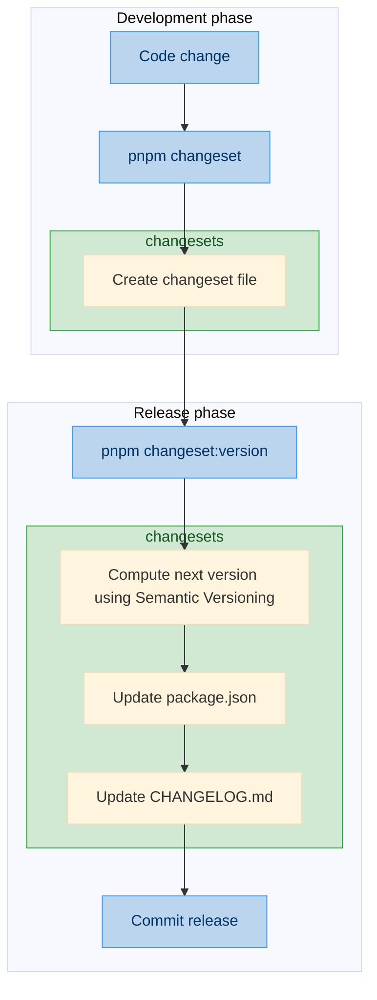

# Contributing

## Development

### Installation

> [!IMPORTANT]
> Before getting started, make sure you have the following prerequisites installed:
> - [Node.js](https://nodejs.org/) >= 20
> - [pnpm](https://pnpm.io/) >= 10

```bash
# Clone the repository
git clone https://github.com/kalisio/services-ekosystem.git
cd services-ekosystem

# Install dependencies
pnpm install
```

### Linting

```bash
# Lint all packages
pnpm lint

# Lint a specific package
pnpm lint:<package>
```

> [!NOTE]
> **services-ekosystem** follows the [standardJS](https://standardjs.com/) style guide for linting and code consistency.
> By default, **standard** is called with the `--fix` option to automatically fix style issues before committing.

### Testing

```bash
# Test all packages
pnpm test

# Test a specific package
pnpm test:<package>

# Run a single test file
pnpm test:<package> <file>.test.js
```

> [!NOTE]
> By default, **vitest** is called with the `--coverage` option to automatically compute the coverage.
> Coverage reports are generated using [v8](https://v8.dev/blog/javascript-code-coverage) provider.

### Building

```bash
# Build all packages
pnpm build

# Build a specific package
pnpm build:<package>
```

### Committing

**services-ekosystem** follows the [Conventional commits specifications](https://www.conventionalcommits.org/en/v1.0.0-beta.3/)
which provides a set of rules to make commit messages more readable when looking through the project history.

The commit message should be structured as follows:

```
<type>[optional scope]: <subject>[optional `breaking`]
```

Where `type` must be one of the following:
* `build`: changes that affect the build system (external dependencies)
* `ci`: changes to our CI configuration files and scripts
* `chore`: changes that affect the project structure
* `docs`: changes that affect the documentation only
* `feat`: a new feature
* `fix`: a bug fix
* `perf`: a code change that improves performance
* `refactor`: a code change that neither fixes a bug nor adds a feature
* `revert`: revert changes
* `style`: changes that do not affect the meaning of the code (lint issues)
* `test`: adding missing tests or correcting existing tests
* `wip`: temporary commits for work in progress

### Versioning

services-ekosystem follows [Semantic Versioning](https://semver.org/) specification. Given a version number
`MAJOR.MINOR.PATCH`, increment the:
* `MAJOR` version when you make incompatible API changes
* `MINOR` version when you add functionality in a backward compatible manner
* `PATCH` version when you make backward compatible bug fixes

To help enforce these rules consistently, we use [Changesets](https://github.com/changesets/changesets) to record
changes during development and automatically determine the next package versions.

The process is illustrated in the diagram below:



#### Development phase

During development, any change that should appear in a release must be recorded by creating a **changeset**:

```bash
pnpm changeset
```

This command will guide you through a short interactive process where you:
- Select the package(s) affected by the change
- Specify the type of version bump (major, minor, or patch) according to **Semantic Versioning**
- Write a short description of the change

A markdown file describing the change is then created in the `.changeset/` directory.

Each **changeset** represents one contribution to the next release. Multiple changesets can accumulate during development.

> [!NOTE]
> It is recommended to create a **changeset** for each significant commit, e.g., a `fix` or `feat`.

#### Release phase

When preparing a release, run:

```bash
pnpm changeset:version
```

**Changesets** then automatically:
- updates the `package.json` versions by collecting all pending changesets and applying **Semantic Versioning** rules
- generates or updates the `CHANGELOG.md`
- removes the processed changeset files

Finally, commit the updated versions and changelogs:

```bash
git add . && git commit -m "chore: bump <new version>"
git push
```

### Publishing

To publish the packages to [NPM](https://www.npmjs.com/), use:

```bash
pnpm changeset:publish
git push --follow-tags
```

> [!NOTE]
> When publishing a tag will be created corresponding to the **version** defined in the `package.json`

### Extending

Want to add a new package or create a new example? The [meta-ekosystem](https://github.com/kalisio/meta-ekosystem) project
offers convenient commands like [k-init-package](https://github.com/kalisio/meta-ekosystem?tab=readme-ov-file#k-init-package)
and [k-init-example](https://github.com/kalisio/meta-ekosystem?tab=readme-ov-file#k-init-example) to quickly
scaffold your project.

## Submission

### Report a bug

Before creating an issue please make sure you have checked out the docs, you might want to also try searching Github.
It's pretty likely someone has already asked a similar question.

Issues can be reported in the [issue tracker](https://github.com/kalisio/services-ekosystem/issues).

### Pull Requests

We love pull requests and we're continually working to make it as easy as possible for people to contribute.

We prefer small pull requests with minimal code changes. The smaller they are the easier they are to review and merge.
A core team member will pick up your PR and review it as soon as they can. They may ask for changes or reject your
pull request. This is not a reflection of you as an engineer or a person. Please accept feedback graciously as we
will also try to be sensitive when providing it.

Although we generally accept many PRs they can be rejected for many reasons. We will be as transparent as possible
but it may simply be that you do not have the same context or information regarding the roadmap that the core team
members have. We value the time you take to put together any contributions so we pledge to always be respectful of
that time and will try to be as open as possible so that you don't waste it.

## Code of Conduct

As contributors and maintainers of this project, we pledge to respect all people who contribute through reporting issues,
posting feature requests, updating documentation, submitting pull requests or patches, and other activities.

We are committed to making participation in this project a harassment-free experience for everyone, regardless of level of
experience, gender, gender identity and expression, sexual orientation, disability, personal appearance, body size, race,
ethnicity, age, or religion.

Examples of unacceptable behavior by participants include the use of sexual language or imagery, derogatory comments or
personal attacks, trolling, public or private harassment, insults, or other unprofessional conduct.

Project maintainers have the right and responsibility to remove, edit, or reject comments, commits, code, wiki edits,
issues, and other contributions that are not aligned to this Code of Conduct. Project maintainers who do not follow the
Code of Conduct may be removed from the project team.

Instances of abusive, harassing, or otherwise unacceptable behavior may be reported by opening an issue or contacting one
or more of the project maintainers.

This Code of Conduct is adapted from the [Contributor Covenant](http://contributor-covenant.org), version 1.0.0,
available at [http://contributor-covenant.org/version/1/0/0/](http://contributor-covenant.org/version/1/0/0/)